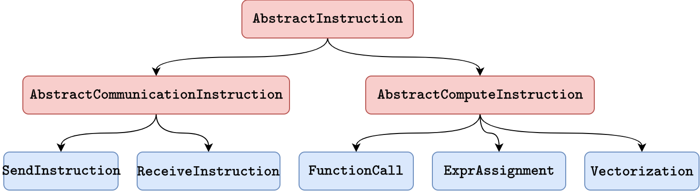

```@meta
CurrentModule = ComputableDAGs
```

# Function Calls

This section is about the representation of instructions in the project.



## Types

```@docs
AbstractInstruction
AbstractComputeInstruction
AbstractCommunicationInstruction
FunctionCall
ExprAssignment
SendInstruction
RecvInstruction
VectorizedCall
Accumulation
```

## Functions
```@docs
access_expr
lower_to_expr
unroll_symbol_vector
```
